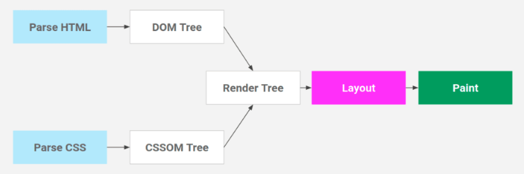
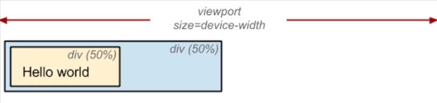
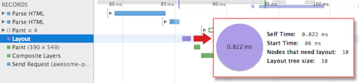

# Week 1 Assignment

1.  ### When a user enters an URL in the browser, how does the browser fetch the desired result ? Explain this with the below in mind and Demonstrate this by drawing a diagram for the same.

    
    When a user enters an URL in the browser, the following steps are involved:
    
    - **URL Parsing:** The browser parses the URL to extract the protocol (e.g. http, https), domain name, and path of the requested resource.
        
    - **DNS Lookup:** The browser looks up the IP address of the domain name in the Domain Name System (DNS) server.
        
    - **TCP Connection:** The browser opens a TCP connection with the server using the IP address and port number.
        
    - **HTTP Request:** The browser sends an HTTP request to the server, specifying the method (e.g. GET, POST), headers, and body (if applicable).
        
    - **Server Processing:** The server receives the request, processes it, and generates a response.
        
    - **HTTP Response:** The server sends an HTTP response to the browser, containing the status code, headers, and body (e.g. HTML, CSS, JavaScript).
            
    - **Rendering:** The browser parses the response, renders the HTML, applies the styles, executes the JavaScript, and displays the page on the screen.

    Here is a diagram to illustrate the steps involved:

    

    ***<p style="text-align: center;">fig. Website loading process in browser</p>***


2. ### What is the main functionality of the browser?

    The main functionality of a web browser is to allow users to access and view information on the World Wide Web. It does this by requesting web pages from web servers, interpreting the HTML code and displaying the content of the web pages on the user's device.
    
    In addition to displaying web pages, modern web browsers also support a wide range of features and functions such as:
    
    - **Navigation:** Browsers allow users to navigate the web by typing URLs or searching for keywords.
        
    - **Bookmarks:** Users can save URLs for later access and organize them into folders.
        
    - **Tabs:** Users can open multiple web pages in separate tabs within the same browser window.
        
    - **History:** Browsers keep a record of web pages visited for easy retrieval.
        
    - **Extensions and add-ons:** Browsers allow third-party developers to create extensions and add-ons that add additional functionality to the browser, such as ad-blockers, password managers, and more.
        
    - **Cookies and caching:** Browsers store cookies and cache data to improve browsing performance and save preferences for users.
            
    - **Security:** Browsers implement security measures to protect users from malicious websites, phishing scams, and other online threats.

    Overall, the browser acts as a gateway to the internet, allowing users to access and interact with the vast array of information and resources available on the web.

3.  ### High Level Components of a browser.

    The high-level components of a browser include:
    
    - **User interface:** This is the graphical user interface that allows users to interact with the browser. It includes features such as address bar, back and forward buttons, bookmarks, tabs, and menu options.
        
    - **Rendering engine:** This component is responsible for rendering and displaying web pages in the browser window. Different browsers use different rendering engines, such as Blink (used by Chrome and Opera), Gecko (used by Firefox), and WebKit (used by Safari).
        
    - **JavaScript engine:** This component interprets and executes JavaScript code on web pages. Popular JavaScript engines include V8 (used by Chrome and Opera), SpiderMonkey (used by Firefox), and JavaScriptCore (used by Safari).
        
    - **Networking:** This component is responsible for handling network requests made by the browser. It includes features such as HTTP request/response handling, caching, and security protocols like HTTPS.
        
    - **Browser extensions/plugins:** These are optional components that can be installed in the browser to provide additional functionality, such as ad blockers, password managers, and developer tools.
        
    - **Data storage:** Browsers store data locally, including cookies, history, and cache. This component manages data storage and retrieval.
            
    - **Security:** This component includes features such as SSL/TLS encryption, phishing protection, and malware detection. It is responsible for ensuring the safety and security of users' browsing activities.

4.  ### Rendering engine and its use.

    A rendering engine is a software component responsible for rendering web content in a web browser. Its primary function is to interpret HTML, CSS, and JavaScript code and display the content on a user's device in a way that is visually appealing and user-friendly. Rendering engines are used by web browsers, email clients, and other applications that display web content.
        
    The rendering engine works by receiving HTML, CSS, and JavaScript code from a website's server, and then parsing and interpreting that code to display the website's content in the user's browser. The rendering engine also handles the layout and formatting of the website's content, including text, images, and multimedia elements.
        
    There are several different rendering engines used in web browsers, including:
    - **Blink:** Developed by Google, Blink is used in the Google Chrome and Microsoft Edge browsers.
        
    - **WebKit:** Originally developed by Apple, WebKit is used in the Safari browser and many other applications.
        
    - **Gecko:** Developed by Mozilla, Gecko is used in the Firefox browser and other Mozilla applications.
        
    - **Trident:** Developed by Microsoft, Trident was used in the Internet Explorer browser before it was replaced by Edge.

    Rendering engines are an essential component of web browsers, as they ensure that web content is displayed accurately and consistently across different devices and platforms. They also enable developers to create dynamic and engaging web content using HTML, CSS, and JavaScript, which are the building blocks of modern web development.

5.  ### Parsers (HTML, CSS, etc).

    Parsers are programs or software components that are used to analyze, interpret, and convert code from one format to another. Parsers are commonly used in web development to parse HTML, CSS, and other markup languages.

    

    ***<p style="text-align: center;">fig. Parsing in browser</p>***
        
    - **HTML parser:** An HTML parser is a software component that reads HTML code and creates a tree-like representation of the document, which can be used to display the document in a web browser. The HTML parser also performs error checking to ensure that the HTML code is valid.
        
    - **CSS parser:** A CSS parser is a software component that reads CSS code and creates a tree-like representation of the style rules, which can be used to apply styles to HTML elements. The CSS parser also performs error checking to ensure that the CSS code is valid.
        
    - **JavaScript parser:** A JavaScript parser is a software component that reads JavaScript code and creates an abstract syntax tree (AST), which can be used to analyze and execute the code. The JavaScript parser also performs error checking to ensure that the code is valid.
        
    - **Other parsers:** There are many other types of parsers used in web development, including XML parsers, JSON parsers, and Markdown parsers. These parsers are used to read and convert data in these formats to a format that can be used by other software components or applications.

    Overall, parsers are important tools in web development because they allow developers to work with code in a more flexible and efficient way, enabling them to create more sophisticated and responsive web applications.

6.  ### Script Processors

    Script processors are programs that are used to interpret and execute scripts in web pages. In the context of web development, there are several types of script processors that are commonly used, including:

    - **JavaScript engines:** JavaScript is the most commonly used scripting language on the web, and there are a number of different JavaScript engines that are used to interpret and execute JavaScript code in web pages. Some of the most popular JavaScript engines include V8 (used in Google Chrome), SpiderMonkey (used in Mozilla Firefox), and JavaScriptCore (used in Safari).
        
    - **PHP engines:** PHP is a server-side scripting language that is commonly used to create dynamic web pages. There are a number of different PHP engines that are available, including Zend Engine, HHVM, and Phalanger.
        
    - **Ruby engines:** Ruby is a dynamic, object-oriented scripting language that is often used for web development. Some of the most popular Ruby engines include MRI (Matz's Ruby Interpreter), JRuby (a version of Ruby that runs on the Java Virtual Machine), and Rubinius (a Ruby implementation written in Ruby).
        
    - **Python engines:** Python is a popular general-purpose programming language that is often used for web development. There are a number of different Python engines that are available, including CPython (the default Python implementation), PyPy (a faster implementation of Python), and Jython (a version of Python that runs on the Java Virtual Machine).

    Overall, script processors play a critical role in enabling dynamic, interactive web pages by interpreting and executing the scripts that power these pages.


7.  ### Tree construction

    A tree structure is commonly used to represent the hierarchy of HTML elements on a webpage. This is known as the Document Object Model (DOM), which is a tree-like structure that represents the HTML document as a collection of nodes and objects.

    The process of constructing a tree structure of HTML elements in a web browser involves several steps:

    - **Parsing:** When a web page is loaded, the browser retrieves the HTML markup and begins parsing it. Parsing involves breaking down the markup into a sequence of tokens that can be processed by the browser.
        
    - **Tokenization:** The browser tokenizes the HTML markup into a stream of tokens, including tags, attributes, text, and comments. Each token represents a piece of content in the HTML document.
        
    - **Building the DOM tree:** Using the stream of tokens generated in the previous step, the browser constructs the DOM tree by creating a node for each element in the HTML markup. The tree structure is based on the hierarchy of the HTML elements in the markup.
        
    - **Constructing the render tree:** Once the DOM tree has been constructed, the browser creates a separate render tree, which is used to display the web page on the screen. The render tree includes only the nodes that are visible on the page, and excludes nodes that are hidden or not visible.

    
    
    ***<p style="text-align: center;">fig. Render tree construction</p>***
      
    - **Rendering the page:** Finally, the browser uses the render tree to render the web page on the screen. This involves applying styles and layout rules to the nodes in the render tree, and rendering them in the appropriate order on the screen.
            
    Throughout this process, the browser may also execute JavaScript code embedded in the HTML document, which can modify the DOM tree and the appearance of the web page dynamically.

8.  ### Order of script processing

    In a browser, scripts are processed by the browser's JavaScript engine. The typical order of script processing in a browser is as follows:

    - **Loading:** When a web page is loaded, the browser downloads any external scripts referenced in the HTML code and adds them to a script queue.
        
    - **Parsing:** The browser's HTML parser reads the script tags and adds the scripts to the script execution environment. At this stage, the browser performs lexical and syntax analysis on the scripts.
        
    - **Compilation:** The browser's JavaScript engine compiles the scripts into bytecode or machine code. This involves optimizing the code and generating an abstract syntax tree.
        
    - **Execution:** The compiled code is executed by the browser's JavaScript engine. At this stage, any functions or variables declared in the script are added to the global namespace, and any event handlers specified in the script are registered with the browser's event system.

    - **Rendering:** Once the scripts have been executed, the browser continues rendering the page. If the scripts modify the HTML or CSS, the browser may need to re-render parts of the page.

    In a browser, scripts are executed in the order they are encountered in the HTML code. However, there are some nuances to this order of execution due to the asynchronous nature of script loading and execution.

    - **Scripts in the head section:** Scripts that are included in the head section of the HTML document are typically loaded and executed before the page content is rendered. If there are multiple scripts in the head section, they are executed in the order they appear in the HTML code.
    - **Scripts in the body section:** Scripts that are included in the body section of the HTML document are typically loaded and executed after the page content is rendered. If there are multiple scripts in the body section, they are executed in the order they appear in the HTML code.
    - **Asynchronous scripts:** Scripts that are loaded with the async attribute are executed asynchronously, which means that they can be executed out of order. An async script will not block the rendering of the page and will execute as soon as it is loaded, regardless of the order in which it appears in the HTML code.
    - **Deferred scripts:** Scripts that are loaded with the defer attribute are also executed asynchronously, but they are executed in the order they appear in the HTML code. However, deferred scripts are not executed until the page content is loaded and parsed, so they may not be executed immediately after the other scripts in the body section.
    - **Scripts loaded via XHR or dynamically:** Scripts that are loaded via XHR (XMLHttpRequest) or dynamically via JavaScript are executed as soon as they are loaded, regardless of their position in the HTML code.

    It's important to note that the order of script execution can have implications for script dependencies and timing issues. Care should be taken to ensure that scripts are loaded and executed in the correct order to avoid unexpected behavior.


9.  ### Layout and Painting

    Layout refers to the process of determining the size and position of elements on a webpage. When a webpage is loaded, the browser first calculates the layout of the elements based on their size, position, and relationships with other elements on the page. This process is important for ensuring that the content is displayed correctly and that there is no overlapping or clipping of elements.

    To figure out the exact size and position of each object on the page, the browser begins at the root of the render tree and traverses it. Let's consider a simple, hands-on example:

    ```html
    <!DOCTYPE html>
    <html>
      <head>
        <meta name="viewport" content="width=device-width,initial-scale=1" />
        <title>Critial Path: Hello world!</title>
      </head>
      <body>
        <div style="width: 50%">
          <div style="width: 50%">Hello world!</div>
        </div>
      </body>
    </html>
    ```
    The body of the above page contains two nested div's: the first (parent) div sets the display size of the node to 50% of the viewport width, and the second div---contained by the parent---sets its width to be 50% of its parent; that is, 25% of the viewport width.

    
     ***<p style="text-align: center;">fig. Box model computations of layout process</p>***

    The output of the layout process is a "box model," which precisely captures the exact position and size of each element within the viewport: all of the relative measurements are converted to absolute pixels on the screen.

    Finally, now that we know which nodes are visible, and their computed styles and geometry, we can pass this information to the final stage, which converts each node in the render tree to actual pixels on the screen. This step is often referred to as "painting" or "rasterizing."

    This can take some time because the browser has to do quite a bit of work. However, Chrome DevTools can provide some insight into all three of the stages described above. Let's examine the layout stage for our original "hello world" example:

    

    - The "Layout" event captures the render tree construction, position, and size calculation in the Timeline.
    - When layout is complete, the browser issues "Paint Setup" and "Paint" events, which convert the render tree to pixels on the screen.

    The time required to perform render tree construction, layout and paint varies based on the size of the document, the applied styles, and the device it is running on: the larger the document, the more work the browser has; the more complicated the styles, the more time taken for painting also (for example, a solid color is "cheap" to paint, while a drop shadow is "expensive" to compute and render). 
    
    After the process of layout and painting we'll get to see the actual page that is finally visible in the viewport.
